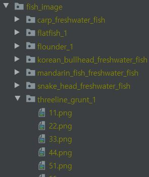
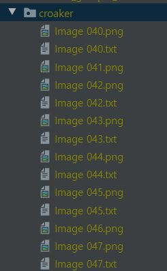
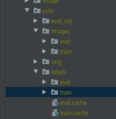

# fish_detection
fish_image_detection

23가지 어종을 기준으로 학습한 weights 파일을 제공 

```
 - 어종 (학습을 위한 영어 매칭)
"black_porgy" : 감성돔
"rockfish" : 우럭
"tripletail" : 참돔
"bass" : 농어
"mackerel" : 고등어
"rock_bream" : 돌돔
"black_rock_fish" : 볼락
"gray_mullet" : 숭어
"threeline_grunt" : 벤자리
"girella_punctata" : 뱅에돔
"flatfish" : 광어
"spotty_belly_greenling" : 노래미
"flounder" : 도다리
"spanish_mackerel" : 삼치
"scorpion_fish" : 쏨팽이
"croaker" : 조기
"bass_freshwater_fish" : 농어_민물고기
"bluegill_freshwater_fish" : 블루길_민물고기
"convict_grouper" : 능성어
"snake_head_freshwater_fish" : 가물치_민물고기 
"korean_bullhead_freshwater_fish" : 동자개_민물고기
"carp_freshwater_fish" : 붕어_민물고기
"mandarin_fish_freshwater_fish" : 쏘가리_민물고기
```


# 1. 데이터 가공 준비

- 준비되어 있는 데이터는 labelimg 프로그램의 yolo포맷으로 만든 데이터 입니다.  <br>

> 따라서 다른 포맷의 데이터를 사용한다면 변형하여 작업 부탁드립니다. <br>

### 데이터 라벨링 <br>

- 처음 물고기 데이터를 태깅할 때 태깅 속도를 빠르게 하기위해 object detection pretrained model을 사용하여 1차 가공을 사용한 후 디텍션 합니다. <br>

##### 사용한 코드 <br>

> https://github.com/kwea123/fish_detection <br>

##### 사용 방법 <br>

코드 위치 : /src/model/pre_detection/main.py <br>

- 실행 예 <br>
python3 ./src/model/pre_detection/main.py -data "학습 데이터 경로" -model "학습된 모델 경로" -show_image "태깅중인 이미지를 볼지 여부 default False" <br>

- 모델 및 데이터  <br>

> - 데이터 <br>
> 대상 디렉토리에 아래 예시와 같이 물고기명 디렉토리로 있어야 하고  그안에 사진들이 들어있어야 한다. <br>
</img>  <br>
> 전부 학습 후 아래 예시와 같이 labelimg 툴에서 사용하는 yolo형식의 결과물이 생성된다 <br>
</img>  <br>

> - 모델 <br>
> 사용한 모델 :  fish_inception_v2_graph/frozen_inference_graph.pb <br>
> 모델 다운로드 방법은 https://github.com/kwea123/fish_detection 참조 <br>


# 2. 가공된 데이터로 학습 

- labelimg 툴로 yolo방식으로 라벨링 된 데이터를 사용한다.

##### 사용 방법 (예시)<br>

코드 위치 : train.py <br>

*코드 상단의 base_path 변수에 파일 위치로 변경*<br>

- 실행 예 <br>
  python3  train.py  --img 640 --batch 8 --epochs 300 --data ./voc.yaml --weights ''<br>

  > 자세한 사용 방법은 yolo v5 참조 
  >
  > https://github.com/ultralytics/yolov5

> - 데이터 <br>
>   대상 디렉토리에 아래 예시와 같이 물고기명 디렉토리로 있어야 하고  그안에 사진들이 들어있어야 한다.
>
>   자세한 내용은 하단 참조


#### voc.yaml 설정 방법

1. voc.yaml 파일의 train과 val 경로에 이미지 경로를 설정한다

> 
>
> 단, 여기에서 경로는 이미지 경로여야 하며 경로중 images 를 labels로 바꾼곳에 label 텍스트 파일들이 위치해야 한다.
>
> ex) ./resources/yolo/images/train -> 라벨 경로 -> ./resources/yolo/labels/train

2. nc   클래스 개수
3. names 클래스의 이름들 설정 (영어)


# 3. predict 실행 방법

##### 사용한 코드 <br>

git url : https://github.com/ultralytics/yolov5 <br>
*자세한 학습 방법과 환경 설정은 위의 github를 참조 바랍니다<br>

-  실행 예시 <br>
detect.py   --source ./resources/yolo/test_img --weights ./snapshots/yolo/exp5/weights/last.pt --output output --save-txt <br>
<br>
> steps size * batch-size 는 데이터의 크기로 지정 <br>

3. 파일 예시 <br>

> - 예측 파일
>
>  --source ./resources/yolo/test_img
>   해당 디렉토리 안에 있는 사진을 대상으로 예측을함
>
> - 학습 모델
>
> yolo_m : https://drive.google.com/file/d/1eShO8DCDJDYGqV9gnWT6a4ZHUEdaYdQT/view
>
> yolo_l : *지원 예정*
> 
> - 사용 환경
>
> docker :  whtngus3232/gpu:cuda10.0_encoding
> 다운로드 후 바로 실행 가능합니다.
 
 
# 데이터 관련 문의
### 물고기 개체명 인식 관련 문의는 "산호오션테크"에 문의 부탁드립니다.
##  